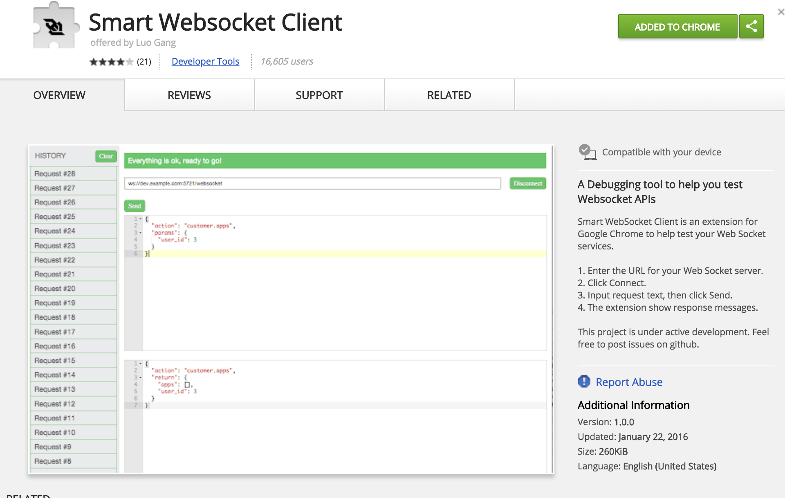

# Websockets Tests
Repo hopes to test websockets by examples.

Table of Contents
- [Treehouse Tutorial](#treehouse-tutorial)
- [Medium Tutorial](#medium-tutorial)
- [3 Servers](#3-servers)
- [Client & Server](#client-server)
- [Websocket Endpoints](#websocket-endpoints)


## Getting Started

Install a websocket client extension for chrome: [Smart Websocket Client](https://chrome.google.com/webstore/detail/smart-websocket-client/omalebghpgejjiaoknljcfmglgbpocdp/related?hl=en-US)
Move into a folder and run server



## Treehouse Tutorial

start server
```
cd treehouse-tutorial
node server.js
```
Does not require the use of the websocket client extension because it loads a website that acts as the client and connects to an external websocket.

[tutorial url](http://blog.teamtreehouse.com/an-introduction-to-websockets)
[tutorial codepen](https://codepen.io/matt-west/pen/tHlBb)

Tutorial goes over using websockets in the client. This repo refactors the setup into OOP structure and adds a few features:

- Disable on open/close clicks
- reinitialize the connection on open click

## Medium Tutorial

[tutorial url](https://medium.com/factory-mind/websocket-node-js-express-step-by-step-using-typescript-725114ad5fe4)

Tutorial runs a websocket server in the same port as the express server. The tutorial uses typescript and in this repo it was not used but the typescript code is commented.

```
cd medium-tutorial
node server.js
```
Open websocket client extension and enter `ws://localhost:8999/` and test sending messages.

## 3 Servers

This directory serves 3 websocket servers. One uses the same port as the express server (8080), the others are on 8081 and 8082.

```
cd ws-servers
node servers.js
```
Open websocket client extension and enter `ws://localhost:8080/` and test sending messages.
Open a new websocket client extension tab by clicking the icon again and enter `ws://localhost:8081/` and test sending messages.

List of servers:

`ws://localhost:8080` - sends a success connection, receives message from client and resends it as success

`ws://localhost:8081` - sends a success connection, receives message from client and resends it as success

`'ws://localhost:8082` - a websocket server with a `setInterval()` and `setTimeout()` that will resend a message with the `Data.now()` every second.

Reference tutorial and repo that were helpful:
[tutorial](https://hackernoon.com/nodejs-web-socket-example-tutorial-send-message-connect-express-set-up-easy-step-30347a2c5535)
[repo](https://github.com/wahengchang/nodejs-websocket-example)

## Client & Server

```
cd server-client
node servers.js
```

This example runs a web server and websocket server at `localhost:8999` and a websocket client connected to to this socket from inside the same `server.js` file.

`ws://localhost:8999` - connection for client

## Websocket Endpoints

```
cd websocket-endpoint
node servers.js
```

This example sets up websocket servers by endpoint using the `express-ws` npm package and middleware. It allow to setup a websocket server by endpoint either by using the default `app.listen(port)` or by passing a custom http server to the express-ws instance. This example also has a websocket client setup to send messages using a `setTimeout()` (needs to be uncommented) and it triggers everytime the server responds to the last message.

`ws://localhost:3000` - you can connect to this websocket server and get some basic data
`ws://localhost:3000/echo` - you can connect to this websocket server and get some basic data with a setTimeout() of 1 second.

## Client

The client connects to a provided websocket server url. Useful for testing connections without having to use the browser.